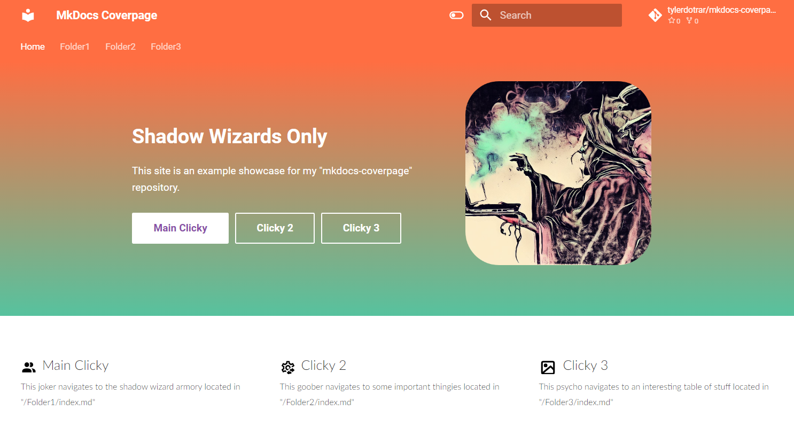
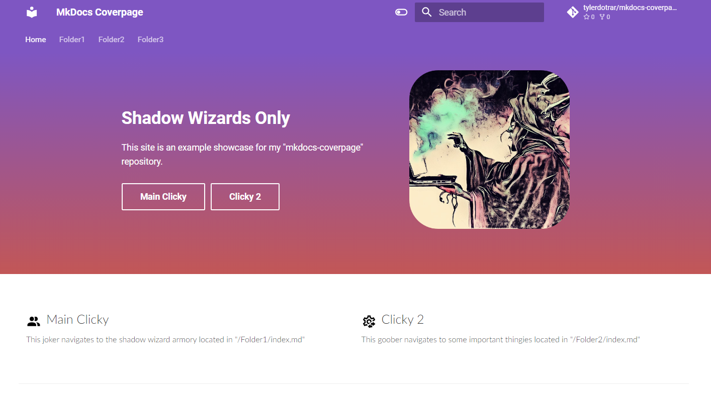
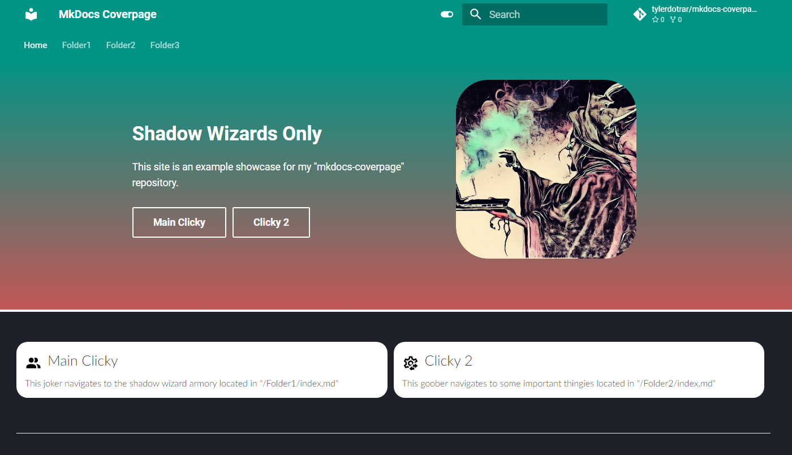
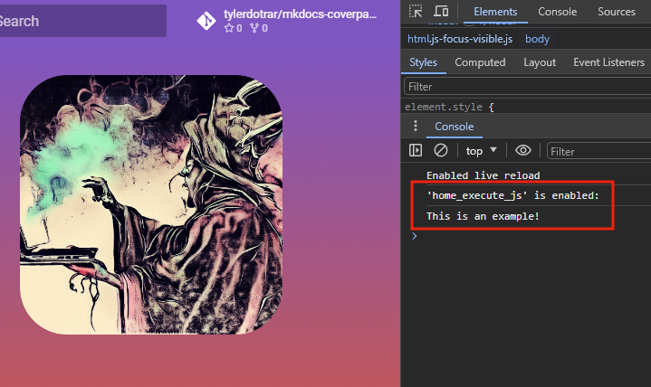
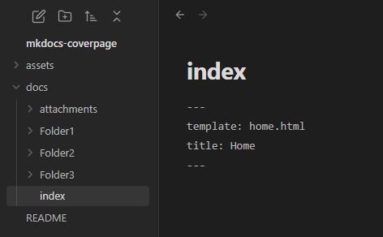

# mkdocs-coverpage
Easily customizable coverpage for an [mkdocs-material](https://github.com/squidfunk/mkdocs-material) site, that is configurable from the `mkdocs.yml` file.
- Original style based off of the cover page from the [up42-py](https://sdk.up42.com/) project.

---

## Gallery

**Light Theme:**

- Material Theme: *Using `deep orange` primary color.*
- Coverpage Settings: *`hsla(160deg,47%,55%,1)` gradient, `md-button md-button--primary` button 1 theme, and all three buttons utilized.*



- Material Theme: *Using `deep purple` primary color.*
- Coverpage Settings: *Using `hsla(0deg,47%,55%,1)` gradient, `md-button` themes, and only two buttons utilized.*



**Dark Theme:**

- Material Theme: *Using `teal` primary color.*
- Coverpage Settings: *`hsla(160deg,47%,55%,1)` gradient, `md-button md-button--primary` button 1 theme, and all three buttons utilized.*


- Material Theme: *Using `teal` primary color.*
- Coverpage Settings: *Using `hsla(0deg,47%,55%,1)` gradient, `md-button` themes, and only two buttons utilized.*



**JavaScript Execution:**

- Coverpage Settings: *Following code stored in `home_execute_js`.*
```js
console.log("This is an example!");
```



---
## Usage

#### 1. Add the `home.html` and `main.html` documents to your designated MkDocs overrides directory.
- In this example, the overrides directory is `assets`.
- `home.html` contains coverpage settings.
- `main.html` contains a fix for when the `navigation.instant` feature is used.

#### 2. Add your overrides directory to `mkdocs.yml` config.
```yml
theme:
  name: material
  custom_dir: assets
```

#### 3. Specify your custom coverpage settings in the `mkdocs.yml` config.
```yml
### Example Configuration ###

# Custom Homepage Elements
home_cover_image: attachments/wizard-posting.png # This path starts at your root mkdocs directory.
home_tagline: Shadow Wizards Only
home_description: |
  This site is an example showcase for my "mkdocs-coverpage" repository.

# Gradient Color
home_gradient_hsla: hsla(0deg,47%,55%,1) # Default Green: hsla(160deg,47%,55%,1)

# Custom Homepage Button(s)
home_button1_name: Main Clicky                   # Comment this parameter out to remove the button.
home_button1_url: Folder1/                       # This path starts at your root mkdocs directory.
home_button1_theme: md-button md-button--primary # Options: "md-button", "md-button md-button--primary"
home_button1_icon: people                        # Options: "people", "gear", "image"
home_button1_blurb: |                            # Short description of this button / section.
  This joker navigates to the shadow wizard armory located in "/Folder1/index.md"

home_button2_name: Clicky 2   # Comment this parameter out to remove the button.
home_button2_url: Folder2/    # This path starts at your root mkdocs directory.
home_button2_theme: md-button # Options: "md-button", "md-button md-button--primary"
home_button2_icon: gear       # Options: "people", "gear", "image"
home_button2_blurb: |         # Short description of this button / section.
  This goober navigates to some important thingies located in "/Folder2/index.md"

home_button3_name: Clicky 3   # Comment this parameter out to remove the button.
home_button3_url: Folder3/    # This path starts at your root mkdocs directory.
home_button3_theme: md-button # Options: "md-button", "md-button md-button--primary"
home_button3_icon: image      # Options: "people", "gear", "image"
home_button3_blurb: |         # Short description of this button / section.
  This psycho navigates to an interesting table of stuff located in "/Folder3/index.md"

# Homepage Code Execution
home_execute_js: | # Javascript to execute when accessing the homepage
  console.log("This is an example!");
```

#### 4. Feed the template (`home.html`) and title properties into your site's root `README.md` / `index.md`.



#### 5. Profit.