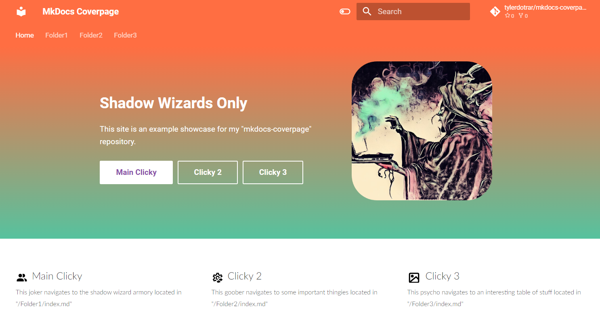
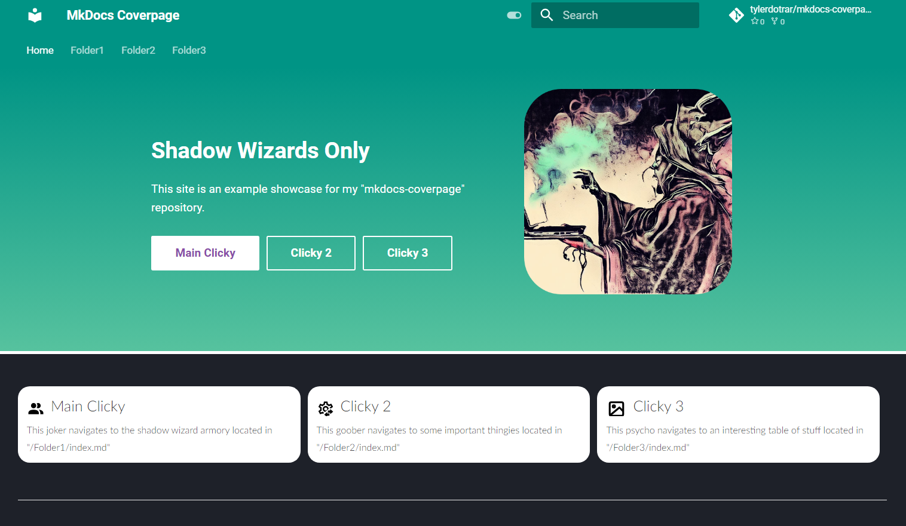

# mkdocs-coverpage
Customizable cover page for an [mkdocs-material](https://github.com/squidfunk/mkdocs-material) site configurable from the `mkdocs.yml` file.
(Based off of the cover page from the [up42-py](https://sdk.up42.com/) project.)

>[!NOTE]
> Feature Request:
> - Add a toggleable parameter for gradient color.
>
> Known Issues to Fix:
> - When hosted with gh-pages, color palette toggle does not work.
> - Cover page buttons can be removed, but their description boxes don't.

## Gallery

- **Light Theme** (with 'dark-orange' primary color)


- **Dark Theme** (with 'teal' primary color)


## Usage

#### 1. Add the `home.html` document to your designated MkDocs overrides directory
- (In this example, the overrides directory is `assets`).

#### 2. Add your overrides directory to `mkdocs.yml` config.
```yml
theme:
  name: material
  custom_dir: assets
```

#### 3. Specify your custom coverpage settings in the `mkdocs.yml` config.
```yml
### AVAILABLE PARAMETERS ###

# Custom Homepage Elements

home_cover_image: attachments/wizard-posting.png # This path starts at your root mkdocs directory.
home_tagline: Shadow Wizards Only
home_description: |
  This site is an example showcase for my "mkdocs-coverpage" repository. 

# Custom Homepage Button(s)

home_button1_name: Clicky 1 # Comment this parameter out to remove the button.
home_button1_url: Folder1/ # This path starts at your root mkdocs directory.
home_button1_theme: md-button md-button-primary # Options: "md-button", "md-button md-button--primary"
home_button1_icon: people # Options: "people", "gear", "image"
home_button1_blurb: This joker navigates to the shadow wizard armory located in "/Folder1/index.md"

home_button2_name: Clicky 2 # Comment this parameter out to remove the button.
home_button2_url: Folder2/ # This path starts at your root mkdocs directory.
home_button2_theme: md-button # Options: "md-button", "md-button md-button--primary"
home_button2_icon: gear # Options: "people", "gear", "image"
home_button2_blurb: This goober navigates to some important thingies located in "/Folder2/index.md"

home_button3_name: Clicky 3 # Comment this parameter out to remove the button.
home_button3_url: Folder3/ # This path starts at your root mkdocs directory.
home_button3_theme: md-button # Options: "md-button", "md-button md-button--primary"
home_button3_icon: image # Options: "people", "gear", "image"
home_button3_blurb: This psycho navigates to an interesting table of stuff located in "/Folder3/index.md"
```

#### 4. Feed the template (`home.html`) and title properties into your site's root `README.md` / `index.md`.


